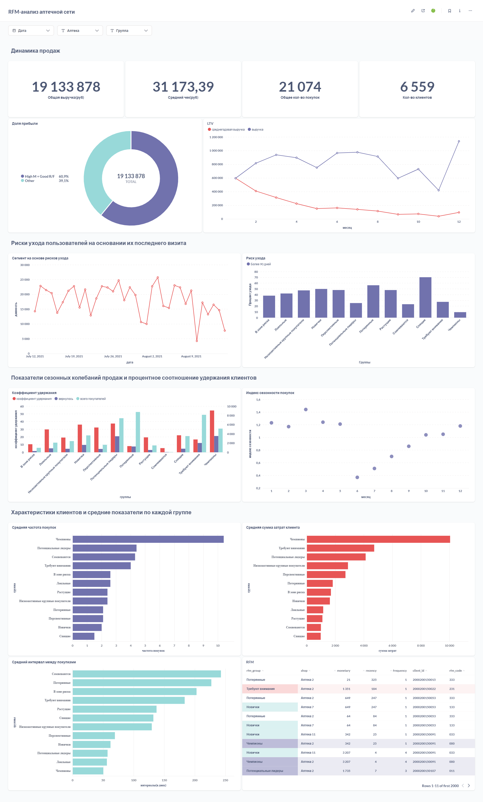

# RFM-анализ клиентской базы аптечной сети с помощью SQL и Metabase 

## Цель проекта
Провести RFM-анализ клиентской базы аптечной сети и подготовить рекомендации для персонализированной СМС-рассылки.

## Использованные инструменты
- **SQL:** оконные функции (OVER()), агрегирующие функции (SUM, COUNT, MIN, MAX, AVG), перцентили (PERCENTILE_CONT), CTE, условная логика (CASE) для классификации клиентов, CROSS JOIN для сравнения с пороговыми значениями, DATE_TRUNC для группировки данных по периоду, CONCAT для формирования объединенных текстовых полей, EXTRACT для анализа по отдельным компонентам даты, NULLIF чтобы избежать деления на ноль, ROUND чтобы округлить полученный результат, AGE чтобы вернуть интервал между двумя датами, DATE_PART для вычислений с датами, LEAST для выбора наименьшего значения без группировки, LEAD тоже оконная функция для анализа последовательности событий, ORDER BY для сортировки получившихся столбцов.
- **BI:** Metabase для построения дашборда

## Метрики
- **Recency (R)** — давность, количество дней с последней покупки клиента.
- **Frequency (F)** — частота, количество покупок клиента за анализируемый период.
- **Monetary (M)** — деньги, общая сумма покупок.
- **LTV** — Lifetime Value, измеряет прибыль, которую компания получает от клиента за всё время его жизни.
- **Индекс сезонности покупок** — в аптечной сети спрос сильно зависит от сезона, поэтому эта метрика поможет планировать акции и рассылки заранее.
- **Коэффициент удержания** — позволяет количественно оценить лояльность и сегментировать клиентов.
- **Риск ухода и сегмент на его основе** — позволяет заранее выявить клиентов, которых нужно простимулировать для удержания, особенно с высокой суммой покупок.
- **Средний интервал на основе рисков ухода** — позволяет выявить средний интервал между покупками клиентов, которые имеют риск ухода.
- **Средний интервал между покупками** — дополняет метрику recency, помогая выявить спящих клиентов и клиентов с сезонной активностью.
- **Средняя сумма затрат клиента** — дополняет метрику monetary, помогая выявить какие группы сегментов имеют в среднем наибольший вклад в прибыль.
- **Средняя частота покупок** — дополняет метрику frequency, помогая выявить среднюю частоту покупок в сегментах.
- **Доля прибыли** 
- **Кол-во покупок** 
- **Кол-во клиентов** 
- **Общая выручка** 
- **Средний чек** 

На основании перцентилей(0.25, 0.5, 0.75) клиенты были классифицированы и объединены в 12 сегментов.

## Гипотезы
- **Лояльность и частота покупок** — Клиенты, которые покупали 3+ раза за последние 3–6 месяцев, с большей вероятностью откликнутся на персональную скидку.
- **Гипотезы на основе RFM** — Клиенты с высоким M и удовлетворительным R/F формируют основную часть прибыли аптечной сети и могут быть вовлечены в программы лояльности, бонусные карты; клиенты с высокой частотой покупок более лояльны и чаще реагируют на персональные предложения.
- **Риск ухода** — Клиенты с высоким риском ухода нуждаются в срочном персональном предложении.
- **Гипотезы на основе интервалов и поведения** — Клиенты с высокой средней суммой затрат формируют большую долю прибыли при меньшем количестве покупок; клиенты с большим количеством покупок имеют выше LTV и ниже риск ухода.
- **Индекс сезонности покупок** — Клиенты с высоким индексом сезонности делают большую часть покупок в определённые месяцы, и в несезон их R резко растёт.

## Дашборд
Интерактивный дашборд создан в **Metabase**, с возможностью фильтрации по периодам, аптекам и RFM-группам.
[🔗 Ссылка на дашборд](http://metabase.simulative.ru/public/dashboard/e2745bdf-6f26-44e3-a1dd-f167d732f6fd)



## SQL-запросы для сегментации и вычисления метрик, краткие выводы по каждому из них
<details>
<summary>🔗 SQL-запрос "RFM": нажмите, чтобы раскрыть</summary>

````sql
-- Из таблицы bonuscheques берем все необходимые поля для RFM-анализа, так же добавляем два фильтра
WITH transactions AS (
    SELECT
        bonuscheques.card AS client_id,
        bonuscheques.doc_id,
        bonuscheques.shop,
        bonuscheques.datetime :: DATE AS transaction_date,
        MAX(bonuscheques.datetime :: DATE) OVER () AS current_dt,
        bonuscheques.summ_with_disc AS purchase_amount
      FROM bonuscheques 
      JOIN shops ON shops.name = bonuscheques .shop
      WHERE 
        bonuscheques.card SIMILAR TO '200%'
        [[AND {{date}}]]                      
        [[AND {{shops}}]]  
),
-- Считаем recency, frequency и monetary
rfm_base AS (
    SELECT 
        client_id,
        shop,
        MIN(current_dt - transaction_date) AS recency,
        COUNT(DISTINCT doc_id) AS frequency,
        SUM(purchase_amount) AS monetary
    FROM transactions
    GROUP BY client_id, shop
),
-- Рассчитываем пороговые значения с помощью перцентилей
percentiles AS (
    SELECT
        PERCENTILE_CONT(0.25) WITHIN GROUP (ORDER BY recency) AS r25,
        PERCENTILE_CONT(0.5)  WITHIN GROUP (ORDER BY recency) AS recency_median,
        PERCENTILE_CONT(0.75) WITHIN GROUP (ORDER BY recency) AS r75,
        PERCENTILE_CONT(0.25) WITHIN GROUP (ORDER BY frequency) AS f25,
        PERCENTILE_CONT(0.5)  WITHIN GROUP (ORDER BY frequency) AS frequency_median,
        PERCENTILE_CONT(0.75) WITHIN GROUP (ORDER BY frequency) AS f75,
        PERCENTILE_CONT(0.25) WITHIN GROUP (ORDER BY monetary) AS m25,
        PERCENTILE_CONT(0.5)  WITHIN GROUP (ORDER BY monetary) AS monetary_median,
        PERCENTILE_CONT(0.75) WITHIN GROUP (ORDER BY monetary) AS m75
    FROM rfm_base
),
-- Присваиваем каждому перцентилю группу
rfm_ranked AS (
    SELECT
        r.client_id,
        r.shop,
        CASE 
            WHEN recency <= p.r25 THEN 0
            WHEN recency <= p.recency_median THEN 1
            WHEN recency <= p.r75 THEN 2
            ELSE 3
        END AS r_rank,
        CASE 
            WHEN frequency <= p.f25 THEN 3
            WHEN frequency <= p.frequency_median THEN 2
            WHEN frequency <= p.f75 THEN 1
            ELSE 0
        END AS f_rank,
        CASE 
            WHEN monetary <= p.m25 THEN 3
            WHEN monetary <= p.monetary_median THEN 2
            WHEN monetary <= p.m75 THEN 1
            ELSE 0
        END AS m_rank
    FROM rfm_base r
    CROSS JOIN percentiles p
),
-- Соединяем посчитанные группы в один целый RFM сегмент
all_rfm as (
    SELECT
        client_id,
        shop,
        CONCAT(r_rank, f_rank, m_rank) AS rfm_code
    FROM rfm_ranked
),
-- Даем каждому сегменту название исходя из его показателей
rfm_final AS (
    SELECT
        client_id,
        rfm_code,
        shop,
        CASE
            WHEN rfm_code IN ('000') THEN 'Чемпионы'
            WHEN rfm_code IN ('001', '110', '111', '101', '011', '100', '010') THEN 'Потенциальные лидеры'
            WHEN rfm_code IN ('122', '123','023', '013', '022', '112', '113', '012', '002', '003', '102', '103') THEN 'Лояльные'
            WHEN rfm_code IN ('021', '031', '020', '030', '121', '131', '120', '130', '201') THEN 'Перспективные'
            WHEN rfm_code IN ('210', '220', '211', '221', '230') THEN 'Низкоактивные крупные покупатели'
            WHEN rfm_code IN ('222', '212', '213', '223', '202', '203') THEN 'Растущие'
            WHEN rfm_code IN ('133', '132', '033', '032') THEN 'Новички'
            WHEN rfm_code IN ('330','331', '320', '310', '321', '311', '200', '300', '301', '231') THEN 'Требуют внимания'
            WHEN rfm_code IN ('303', '302') THEN 'Сомневаются'
            WHEN rfm_code IN ('313', '312') THEN 'В зоне риска'
            WHEN rfm_code IN ('322', '323', '232', '233') THEN 'Спящие'
            WHEN rfm_code IN ('332', '333') THEN 'Потерянные'
            ELSE 'Прочие'
        END AS rfm_group
    FROM all_rfm
)
-- Выводим все в отдельную таблицу, добавляем фильтр по сегментам
SELECT r.rfm_group,
r.shop,
rf.monetary,
rf.recency, 
rf.frequency,
r.client_id,
r.rfm_code
FROM rfm_base rf
JOIN rfm_final r 
ON rf.client_id = r.client_id
WHERE 1=1
  [[AND r.rfm_group = {{rfm_group}}]]
````
</details>

На выходе получаем табличку с характеристиками клиента: айди (карта), в каком сегменте он находится, из какой аптеки и его показатели monetary, recency, frequency с полным rfm-кодом.

<details>
<summary>🔗 SQL-запрос "LTV": нажмите, чтобы раскрыть</summary>

````sql
-- Из таблицы bonuscheques берем все необходимые поля для RFM-анализа, так же добавляем два фильтра
WITH transactions AS (
    SELECT
        bonuscheques.card AS client_id,
        bonuscheques.doc_id,
        bonuscheques.shop,
        bonuscheques.datetime :: DATE AS transaction_date,
        MAX(bonuscheques.datetime :: DATE) OVER () AS current_dt,
        bonuscheques.summ_with_disc AS purchase_amount
      FROM bonuscheques 
      JOIN shops ON shops.name = bonuscheques .shop
      WHERE 
        bonuscheques.card SIMILAR TO '200%'
        [[AND {{date}}]]                      
        [[AND {{shops}}]]  
),
-- Считаем recency, frequency и monetary
rfm_base AS (
    SELECT 
        client_id,
        shop,
        MIN(current_dt - transaction_date) AS recency,
        COUNT(DISTINCT doc_id) AS frequency,
        SUM(purchase_amount) AS monetary
    FROM transactions
    GROUP BY client_id, shop
),
-- Рассчитываем пороговые значения с помощью перцентилей
percentiles AS (
    SELECT
        PERCENTILE_CONT(0.25) WITHIN GROUP (ORDER BY recency) AS r25,
        PERCENTILE_CONT(0.5)  WITHIN GROUP (ORDER BY recency) AS recency_median,
        PERCENTILE_CONT(0.75) WITHIN GROUP (ORDER BY recency) AS r75,
        PERCENTILE_CONT(0.25) WITHIN GROUP (ORDER BY frequency) AS f25,
        PERCENTILE_CONT(0.5)  WITHIN GROUP (ORDER BY frequency) AS frequency_median,
        PERCENTILE_CONT(0.75) WITHIN GROUP (ORDER BY frequency) AS f75,
        PERCENTILE_CONT(0.25) WITHIN GROUP (ORDER BY monetary) AS m25,
        PERCENTILE_CONT(0.5)  WITHIN GROUP (ORDER BY monetary) AS monetary_median,
        PERCENTILE_CONT(0.75) WITHIN GROUP (ORDER BY monetary) AS m75
    FROM rfm_base
),
-- Присваиваем каждому перцентилю группу
rfm_ranked AS (
    SELECT
        r.client_id,
        r.shop,
        CASE 
            WHEN recency <= p.r25 THEN 0
            WHEN recency <= p.recency_median THEN 1
            WHEN recency <= p.r75 THEN 2
            ELSE 3
        END AS r_rank,
        CASE 
            WHEN frequency <= p.f25 THEN 3
            WHEN frequency <= p.frequency_median THEN 2
            WHEN frequency <= p.f75 THEN 1
            ELSE 0
        END AS f_rank,
        CASE 
            WHEN monetary <= p.m25 THEN 3
            WHEN monetary <= p.monetary_median THEN 2
            WHEN monetary <= p.m75 THEN 1
            ELSE 0
        END AS m_rank
    FROM rfm_base r
    CROSS JOIN percentiles p
),
-- Соединяем посчитанные группы в один целый RFM сегмент
all_rfm as (
    SELECT
        client_id,
        shop,
        CONCAT(r_rank, f_rank, m_rank) AS rfm_code
    FROM rfm_ranked
),
-- Даем каждому сегменту название исходя из его показателей
rfm_final AS (
    SELECT
        client_id,
        rfm_code,
        shop,
        CASE
            WHEN rfm_code IN ('000') THEN 'Чемпионы'
            WHEN rfm_code IN ('001', '110', '111', '101', '011', '100', '010') THEN 'Потенциальные лидеры'
            WHEN rfm_code IN ('122', '123','023', '013', '022', '112', '113', '012', '002', '003', '102', '103') THEN 'Лояльные'
            WHEN rfm_code IN ('021', '031', '020', '030', '121', '131', '120', '130', '201') THEN 'Перспективные'
            WHEN rfm_code IN ('210', '220', '211', '221', '230') THEN 'Низкоактивные крупные покупатели'
            WHEN rfm_code IN ('222', '212', '213', '223', '202', '203') THEN 'Растущие'
            WHEN rfm_code IN ('133', '132', '033', '032') THEN 'Новички'
            WHEN rfm_code IN ('330','331', '320', '310', '321', '311', '200', '300', '301', '231') THEN 'Требуют внимания'
            WHEN rfm_code IN ('303', '302') THEN 'Сомневаются'
            WHEN rfm_code IN ('313', '312') THEN 'В зоне риска'
            WHEN rfm_code IN ('322', '323', '232', '233') THEN 'Спящие'
            WHEN rfm_code IN ('332', '333') THEN 'Потерянные'
            ELSE 'Прочие'
        END AS rfm_group
    FROM all_rfm
),
-- Получаем сводку продаж по каждому месяцу
customer_revenue AS (
    SELECT 
        COUNT(DISTINCT EXTRACT(MONTH FROM t.transaction_date)) AS active_month,
        t.client_id,
        r.rfm_group,
        SUM(t.purchase_amount) AS revenue
    FROM transactions t
    JOIN rfm_final r
    ON r.client_id = t.client_id
    GROUP BY t.client_id, r.rfm_group
)
-- Выводим все необходимые поля для построения графика и добавляем фильтр
SELECT
    client_id,
    revenue as "выручка",
    active_month "месяц",
    revenue / NULLIF(active_month, 0) AS "среднегодовая выручка"
FROM customer_revenue
WHERE 1=1
    [[AND rfm_group IN ({{rfm_group}})]]
````
</details>

Получаем наглядный график, с помощью которого можно оценить какие сегменты приносят наибольшую прибыль, а так же оценить их годовой вклад. Очень помогает выявить сегмент с высокой выручкой, который требуется простимулировать акциями или бонусами, так как его прибыль может с каждым месяцем идти на спад. Расчет данной метрики полезен для того, чтобы не потерять ценного клиента, так как в обычном разрезе продаж, мы можем не понимать, какие клиенты какую прибыль приносят, ухудшаются ли их продажи с каждым месяцем. Здесь же, после просмотра графика для очень прибыльных сегментов, можно увидить, что некоторые сегменты идут на спад, хотя в начале их прибыль была на пике.

<details>
<summary>🔗 SQL-запрос "Индекс сезонности покупок": нажмите, чтобы раскрыть</summary>

````sql
-- Из таблицы bonuscheques берем все необходимые поля для RFM-анализа, так же добавляем два фильтра
WITH transactions AS (
    SELECT
        bonuscheques.card AS client_id,
        bonuscheques.doc_id,
        bonuscheques.shop,
        bonuscheques.datetime :: DATE AS transaction_date,
        MAX(bonuscheques.datetime :: DATE) OVER () AS current_dt,
        bonuscheques.summ_with_disc AS purchase_amount
      FROM bonuscheques 
      JOIN shops ON shops.name = bonuscheques .shop
      WHERE 
        bonuscheques.card SIMILAR TO '200%'
        [[AND {{date}}]]                      
        [[AND {{shops}}]]  
),
-- Считаем recency, frequency и monetary
rfm_base AS (
    SELECT 
        client_id,
        shop,
        MIN(current_dt - transaction_date) AS recency,
        COUNT(DISTINCT doc_id) AS frequency,
        SUM(purchase_amount) AS monetary
    FROM transactions
    GROUP BY client_id, shop
),
-- Рассчитываем пороговые значения с помощью перцентилей
percentiles AS (
    SELECT
        PERCENTILE_CONT(0.25) WITHIN GROUP (ORDER BY recency) AS r25,
        PERCENTILE_CONT(0.5)  WITHIN GROUP (ORDER BY recency) AS recency_median,
        PERCENTILE_CONT(0.75) WITHIN GROUP (ORDER BY recency) AS r75,
        PERCENTILE_CONT(0.25) WITHIN GROUP (ORDER BY frequency) AS f25,
        PERCENTILE_CONT(0.5)  WITHIN GROUP (ORDER BY frequency) AS frequency_median,
        PERCENTILE_CONT(0.75) WITHIN GROUP (ORDER BY frequency) AS f75,
        PERCENTILE_CONT(0.25) WITHIN GROUP (ORDER BY monetary) AS m25,
        PERCENTILE_CONT(0.5)  WITHIN GROUP (ORDER BY monetary) AS monetary_median,
        PERCENTILE_CONT(0.75) WITHIN GROUP (ORDER BY monetary) AS m75
    FROM rfm_base
),
-- Присваиваем каждому перцентилю группу
rfm_ranked AS (
    SELECT
        r.client_id,
        r.shop,
        CASE 
            WHEN recency <= p.r25 THEN 0
            WHEN recency <= p.recency_median THEN 1
            WHEN recency <= p.r75 THEN 2
            ELSE 3
        END AS r_rank,
        CASE 
            WHEN frequency <= p.f25 THEN 3
            WHEN frequency <= p.frequency_median THEN 2
            WHEN frequency <= p.f75 THEN 1
            ELSE 0
        END AS f_rank,
        CASE 
            WHEN monetary <= p.m25 THEN 3
            WHEN monetary <= p.monetary_median THEN 2
            WHEN monetary <= p.m75 THEN 1
            ELSE 0
        END AS m_rank
    FROM rfm_base r
    CROSS JOIN percentiles p
),
-- Соединяем посчитанные группы в один целый RFM сегмент
all_rfm as (
    SELECT
        client_id,
        shop,
        CONCAT(r_rank, f_rank, m_rank) AS rfm_code
    FROM rfm_ranked
),
-- Даем каждому сегменту название исходя из его показателей
rfm_final AS (
    SELECT
        client_id,
        rfm_code,
        shop,
        CASE
            WHEN rfm_code IN ('000') THEN 'Чемпионы'
            WHEN rfm_code IN ('001', '110', '111', '101', '011', '100', '010') THEN 'Потенциальные лидеры'
            WHEN rfm_code IN ('122', '123','023', '013', '022', '112', '113', '012', '002', '003', '102', '103') THEN 'Лояльные'
            WHEN rfm_code IN ('021', '031', '020', '030', '121', '131', '120', '130', '201') THEN 'Перспективные'
            WHEN rfm_code IN ('210', '220', '211', '221', '230') THEN 'Низкоактивные крупные покупатели'
            WHEN rfm_code IN ('222', '212', '213', '223', '202', '203') THEN 'Растущие'
            WHEN rfm_code IN ('133', '132', '033', '032') THEN 'Новички'
            WHEN rfm_code IN ('330','331', '320', '310', '321', '311', '200', '300', '301', '231') THEN 'Требуют внимания'
            WHEN rfm_code IN ('303', '302') THEN 'Сомневаются'
            WHEN rfm_code IN ('313', '312') THEN 'В зоне риска'
            WHEN rfm_code IN ('322', '323', '232', '233') THEN 'Спящие'
            WHEN rfm_code IN ('332', '333') THEN 'Потерянные'
            ELSE 'Прочие'
        END AS rfm_group
    FROM all_rfm
),
-- Вытягиваем отдельно месяцы и года для группировки, чтобы для каждого посчитать общую выручку
monthly_sales AS (
    SELECT
        EXTRACT(YEAR FROM t.transaction_date) AS year,
        EXTRACT(MONTH FROM t.transaction_date) AS month,
        r.rfm_group,
        SUM(t.purchase_amount) AS total_amount
    FROM transactions t
    JOIN rfm_final r 
    ON r.client_id = t.client_id
    WHERE 1=1
      [[AND r.rfm_group = {{rfm_group}}]] 
    GROUP BY 1, 2, 3
),
-- Считаем среднюю сумму продаж для каждого месяца
average_monthly_sales AS (
    SELECT
        month,
        AVG(total_amount) AS avg_amount
    FROM monthly_sales
    GROUP BY month
),
-- Считаем среднее между всеми месяцами для нормализации данных
overall_avg AS (
    SELECT AVG(avg_amount) AS overall_avg_amount
    FROM average_monthly_sales
)
-- Рассчитываем индекс сезонности, выводим необходимые поля и добавляем фильтр
SELECT
    a.month as "месяц",
    ROUND(a.avg_amount / o.overall_avg_amount, 2) AS "индекс сезонности"
FROM average_monthly_sales a
CROSS JOIN overall_avg o
ORDER BY a.month;
````
</details>

Индекс сезонности покупок помогает оценить в какие месяцы у аптеки самые маленькие продажи, например, в данном случае месяц Июнь выходит самым не прибыльным, а вот самый пик продаж приходится на Март. Это поможет придумать другую тактику продаж в самые не прибыльные месяцы или запустить акцию перед самыми прибыльными для большего роста продаж.

<details>
<summary>🔗 SQL-запрос "Доля прибыли, кол-во покупок, кол-во клиентов, общая выручка, средний чек.": нажмите, чтобы раскрыть</summary>

````sql
-- Из таблицы bonuscheques берем все необходимые поля для RFM-анализа, так же добавляем два фильтра
WITH transactions AS (
    SELECT
        bonuscheques.card AS client_id,
        bonuscheques.doc_id,
        bonuscheques.shop,
        bonuscheques.datetime :: DATE AS transaction_date,
        MAX(bonuscheques.datetime :: DATE) OVER () AS current_dt,
        bonuscheques.summ_with_disc AS purchase_amount
      FROM bonuscheques 
      JOIN shops ON shops.name = bonuscheques .shop
      WHERE 
        bonuscheques.card SIMILAR TO '200%'
        [[AND {{date}}]]                      
        [[AND {{shops}}]]  
),
-- Считаем recency, frequency и monetary
rfm_base AS (
    SELECT 
        client_id,
        shop,
        MIN(current_dt - transaction_date) AS recency,
        COUNT(DISTINCT doc_id) AS frequency,
        SUM(purchase_amount) AS monetary
    FROM transactions
    GROUP BY client_id, shop
),
-- Рассчитываем пороговые значения с помощью перцентилей
percentiles AS (
    SELECT
        PERCENTILE_CONT(0.25) WITHIN GROUP (ORDER BY recency) AS r25,
        PERCENTILE_CONT(0.5)  WITHIN GROUP (ORDER BY recency) AS recency_median,
        PERCENTILE_CONT(0.75) WITHIN GROUP (ORDER BY recency) AS r75,
        PERCENTILE_CONT(0.25) WITHIN GROUP (ORDER BY frequency) AS f25,
        PERCENTILE_CONT(0.5)  WITHIN GROUP (ORDER BY frequency) AS frequency_median,
        PERCENTILE_CONT(0.75) WITHIN GROUP (ORDER BY frequency) AS f75,
        PERCENTILE_CONT(0.25) WITHIN GROUP (ORDER BY monetary) AS m25,
        PERCENTILE_CONT(0.5)  WITHIN GROUP (ORDER BY monetary) AS monetary_median,
        PERCENTILE_CONT(0.75) WITHIN GROUP (ORDER BY monetary) AS m75
    FROM rfm_base
),
-- Присваиваем каждому перцентилю группу
rfm_ranked AS (
    SELECT
        r.client_id,
        r.shop,
        CASE 
            WHEN recency <= p.r25 THEN 0
            WHEN recency <= p.recency_median THEN 1
            WHEN recency <= p.r75 THEN 2
            ELSE 3
        END AS r_rank,
        CASE 
            WHEN frequency <= p.f25 THEN 3
            WHEN frequency <= p.frequency_median THEN 2
            WHEN frequency <= p.f75 THEN 1
            ELSE 0
        END AS f_rank,
        CASE 
            WHEN monetary <= p.m25 THEN 3
            WHEN monetary <= p.monetary_median THEN 2
            WHEN monetary <= p.m75 THEN 1
            ELSE 0
        END AS m_rank
    FROM rfm_base r
    CROSS JOIN percentiles p
),
-- Соединяем посчитанные группы в один целый RFM сегмент
all_rfm as (
    SELECT
        client_id,
        shop,
        CONCAT(r_rank, f_rank, m_rank) AS rfm_code
    FROM rfm_ranked
),
-- Даем каждому сегменту название исходя из его показателей
rfm_final AS (
    SELECT
        client_id,
        rfm_code,
        shop,
        CASE
            WHEN rfm_code IN ('000') THEN 'Чемпионы'
            WHEN rfm_code IN ('001', '110', '111', '101', '011', '100', '010') THEN 'Потенциальные лидеры'
            WHEN rfm_code IN ('122', '123','023', '013', '022', '112', '113', '012', '002', '003', '102', '103') THEN 'Лояльные'
            WHEN rfm_code IN ('021', '031', '020', '030', '121', '131', '120', '130', '201') THEN 'Перспективные'
            WHEN rfm_code IN ('210', '220', '211', '221', '230') THEN 'Низкоактивные крупные покупатели'
            WHEN rfm_code IN ('222', '212', '213', '223', '202', '203') THEN 'Растущие'
            WHEN rfm_code IN ('133', '132', '033', '032') THEN 'Новички'
            WHEN rfm_code IN ('330','331', '320', '310', '321', '311', '200', '300', '301', '231') THEN 'Требуют внимания'
            WHEN rfm_code IN ('303', '302') THEN 'Сомневаются'
            WHEN rfm_code IN ('313', '312') THEN 'В зоне риска'
            WHEN rfm_code IN ('322', '323', '232', '233') THEN 'Спящие'
            WHEN rfm_code IN ('332', '333') THEN 'Потерянные'
            ELSE 'Прочие'
        END AS rfm_group
    FROM all_rfm
),
-- Сегментируем покупателей только на тех у кого высокий M и хороший R/F
rfm_segmented AS (
    SELECT *,
        CASE
            WHEN m_rank IN (0, 1) AND r_rank IN (0, 1)
            AND f_rank IN (0, 1) THEN 'High M + Good R/F'
            ELSE 'Other'
        END AS segment
    FROM rfm_final
)
-- Рассчитываем долю прибыли, кол-во покупок, кол-во клиентов, общую выручку, средний чек и добавляем фильтр
SELECT
  segment,
  rfm_group,
  COUNT(*) AS clients_count,
  SUM(monetary) AS total_revenue,
  SUM(frequency) AS total_purchases,
  SUM(monetary) / COUNT (*) as avg_check,
  ROUND(100.0 * SUM(monetary) / SUM(SUM(monetary)) OVER (), 2) AS revenue_share_percent
FROM
  rfm_segmented
WHERE
  1 = 1
  [[AND rfm_group = {{rfm_group}}]]
GROUP BY segment, rfm_group
ORDER BY revenue_share_percent DESC;
````
</details>

С помощью данного запроса можем вывести карточки с каждой метрикой, плюс доля хорошо отражает, насколько сильно отличается вклад каждой группы в продажи. Эти метрики в связки позволяют понять за счёт каких сегментов растёт бизнес, какие сегменты приносят какой доход и включить в СМС-рассылки только те группы, у которых эти метрики самые положительные для бизнеса.

<details>
<summary>🔗 SQL-запрос "Коэффициент удержания": нажмите, чтобы раскрыть</summary>

````sql
-- Из таблицы bonuscheques берем все необходимые поля для RFM-анализа, так же добавляем два фильтра
WITH transactions AS (
    SELECT
        bonuscheques.card AS client_id,
        bonuscheques.doc_id,
        bonuscheques.shop,
        bonuscheques.datetime :: DATE AS transaction_date,
        MAX(bonuscheques.datetime :: DATE) OVER () AS current_dt,
        bonuscheques.summ_with_disc AS purchase_amount
      FROM bonuscheques 
      JOIN shops ON shops.name = bonuscheques .shop
      WHERE 
        bonuscheques.card SIMILAR TO '200%'
        [[AND {{date}}]]                      
        [[AND {{shops}}]]  
),
-- Считаем recency, frequency и monetary
rfm_base AS (
    SELECT 
        client_id,
        shop,
        MIN(current_dt - transaction_date) AS recency,
        COUNT(DISTINCT doc_id) AS frequency,
        SUM(purchase_amount) AS monetary
    FROM transactions
    GROUP BY client_id, shop
),
-- Рассчитываем пороговые значения с помощью перцентилей
percentiles AS (
    SELECT
        PERCENTILE_CONT(0.25) WITHIN GROUP (ORDER BY recency) AS r25,
        PERCENTILE_CONT(0.5)  WITHIN GROUP (ORDER BY recency) AS recency_median,
        PERCENTILE_CONT(0.75) WITHIN GROUP (ORDER BY recency) AS r75,
        PERCENTILE_CONT(0.25) WITHIN GROUP (ORDER BY frequency) AS f25,
        PERCENTILE_CONT(0.5)  WITHIN GROUP (ORDER BY frequency) AS frequency_median,
        PERCENTILE_CONT(0.75) WITHIN GROUP (ORDER BY frequency) AS f75,
        PERCENTILE_CONT(0.25) WITHIN GROUP (ORDER BY monetary) AS m25,
        PERCENTILE_CONT(0.5)  WITHIN GROUP (ORDER BY monetary) AS monetary_median,
        PERCENTILE_CONT(0.75) WITHIN GROUP (ORDER BY monetary) AS m75
    FROM rfm_base
),
-- Присваиваем каждому перцентилю группу
rfm_ranked AS (
    SELECT
        r.client_id,
        r.shop,
        CASE 
            WHEN recency <= p.r25 THEN 0
            WHEN recency <= p.recency_median THEN 1
            WHEN recency <= p.r75 THEN 2
            ELSE 3
        END AS r_rank,
        CASE 
            WHEN frequency <= p.f25 THEN 3
            WHEN frequency <= p.frequency_median THEN 2
            WHEN frequency <= p.f75 THEN 1
            ELSE 0
        END AS f_rank,
        CASE 
            WHEN monetary <= p.m25 THEN 3
            WHEN monetary <= p.monetary_median THEN 2
            WHEN monetary <= p.m75 THEN 1
            ELSE 0
        END AS m_rank
    FROM rfm_base r
    CROSS JOIN percentiles p
),
-- Соединяем посчитанные группы в один целый RFM сегмент
all_rfm as (
    SELECT
        client_id,
        shop,
        CONCAT(r_rank, f_rank, m_rank) AS rfm_code
    FROM rfm_ranked
),
-- Даем каждому сегменту название исходя из его показателей
rfm_final AS (
    SELECT
        client_id,
        rfm_code,
        shop,
        CASE
            WHEN rfm_code IN ('000') THEN 'Чемпионы'
            WHEN rfm_code IN ('001', '110', '111', '101', '011', '100', '010') THEN 'Потенциальные лидеры'
            WHEN rfm_code IN ('122', '123','023', '013', '022', '112', '113', '012', '002', '003', '102', '103') THEN 'Лояльные'
            WHEN rfm_code IN ('021', '031', '020', '030', '121', '131', '120', '130', '201') THEN 'Перспективные'
            WHEN rfm_code IN ('210', '220', '211', '221', '230') THEN 'Низкоактивные крупные покупатели'
            WHEN rfm_code IN ('222', '212', '213', '223', '202', '203') THEN 'Растущие'
            WHEN rfm_code IN ('133', '132', '033', '032') THEN 'Новички'
            WHEN rfm_code IN ('330','331', '320', '310', '321', '311', '200', '300', '301', '231') THEN 'Требуют внимания'
            WHEN rfm_code IN ('303', '302') THEN 'Сомневаются'
            WHEN rfm_code IN ('313', '312') THEN 'В зоне риска'
            WHEN rfm_code IN ('322', '323', '232', '233') THEN 'Спящие'
            WHEN rfm_code IN ('332', '333') THEN 'Потерянные'
            ELSE 'Прочие'
        END AS rfm_group
    FROM all_rfm
),
-- Находим когда была совершенная первая покупка каждым клиентом
first_tx AS (
    SELECT 
        t.client_id,
        r.rfm_group,
        MIN(t.transaction_date) AS first_purchase
    FROM transactions t
    JOIN rfm_final r 
    ON r.client_id = t.client_id
    GROUP BY t.client_id, r.rfm_group
),
-- Делим клиентов на когорты по их первой покупке
tx_with_month AS (
    SELECT
        t.client_id,
        f.rfm_group,
        f.first_purchase,
        DATE_TRUNC('month', t.transaction_date) AS tx_month,
        DATE_TRUNC('month', f.first_purchase) AS cohort_month
    FROM transactions t
    JOIN first_tx f ON t.client_id = f.client_id
),
-- Считаем интервал между месяцем первой покупки и датой транзакции
retention_period AS (
    SELECT
        client_id,
        rfm_group,
        cohort_month,
        AGE(tx_month, cohort_month) AS period_age
    FROM tx_with_month
),
-- Считаем сколько прошло месяцев после первой покупки
retention_period_months AS (
    SELECT
        client_id,
        cohort_month,
        rfm_group,
        DATE_PART('year', period_age) * 12 + DATE_PART('month', period_age) AS months_after_first
    FROM retention_period
), 
-- Находим сколько в каждой когорте уникальных клиентов
cohort_size AS (
    SELECT cohort_month, 
           rfm_group,
           COUNT(DISTINCT client_id) AS cohort_users
    FROM retention_period_months
    WHERE months_after_first = 0
    GROUP BY cohort_month, rfm_group
)
-- Рассчитываем коэффициент удержания и выводим все необходимые поля
SELECT
    r.cohort_month AS "месяц",
    r.rfm_group AS "группы",
    r.retained_users AS "вернулось",
    c.cohort_users AS "всего покупателей",
    ROUND(LEAST(r.retained_users::numeric, c.cohort_users) / NULLIF(c.cohort_users, 0), 2) AS "коэффициент удержания"
FROM (
    SELECT
        cohort_month,
        rfm_group,
        months_after_first,
        COUNT(DISTINCT client_id) AS retained_users
    FROM retention_period_months
    GROUP BY cohort_month, months_after_first, rfm_group
) r
JOIN cohort_size c 
  ON r.cohort_month = c.cohort_month
 AND r.rfm_group = c.rfm_group
WHERE 1=1
  [[AND r.rfm_group = {{rfm_group}}]]
ORDER BY r.cohort_month, r.months_after_first, r.rfm_group;
````
</details>

По данному запросу, мы можем узнать сколько в каждом сегменте к нам возвращается клиентов. Эта метрика хорошо дает понять, нравится ли наш сервис клиентам, устраивает ли их наш ассортимент, ценовая политика, удовлетворены ли они качеством купленных медикаментов или наоборот. В данном случае, на графике чётко видно, что сегменты потерянные и требуют внимания имеют наибольшее количество покупателей, но они сразу отваливаются, важно понять почему так происходит и продумать тактику для увеличения коэффициента удержания. 

<details>
<summary>🔗 SQL-запрос "Риск ухода и сегмент на его основе": нажмите, чтобы раскрыть</summary>

````sql
-- Из таблицы bonuscheques берем все необходимые поля для RFM-анализа, так же добавляем два фильтра
WITH transactions AS (
    SELECT
        bonuscheques.card AS client_id,
        bonuscheques.doc_id,
        bonuscheques.shop,
        bonuscheques.datetime :: DATE AS transaction_date,
        MAX(bonuscheques.datetime :: DATE) OVER () AS current_dt,
        bonuscheques.summ_with_disc AS purchase_amount
      FROM bonuscheques 
      JOIN shops ON shops.name = bonuscheques .shop
      WHERE 
        bonuscheques.card SIMILAR TO '200%'
        [[AND {{date}}]]                      
        [[AND {{shops}}]]  
),
-- Считаем recency, frequency и monetary
rfm_base AS (
    SELECT 
        client_id,
        shop,
        MIN(current_dt - transaction_date) AS recency,
        COUNT(DISTINCT doc_id) AS frequency,
        SUM(purchase_amount) AS monetary
    FROM transactions
    GROUP BY client_id, shop
),
-- Рассчитываем пороговые значения с помощью перцентилей
percentiles AS (
    SELECT
        PERCENTILE_CONT(0.25) WITHIN GROUP (ORDER BY recency) AS r25,
        PERCENTILE_CONT(0.5)  WITHIN GROUP (ORDER BY recency) AS recency_median,
        PERCENTILE_CONT(0.75) WITHIN GROUP (ORDER BY recency) AS r75,
        PERCENTILE_CONT(0.25) WITHIN GROUP (ORDER BY frequency) AS f25,
        PERCENTILE_CONT(0.5)  WITHIN GROUP (ORDER BY frequency) AS frequency_median,
        PERCENTILE_CONT(0.75) WITHIN GROUP (ORDER BY frequency) AS f75,
        PERCENTILE_CONT(0.25) WITHIN GROUP (ORDER BY monetary) AS m25,
        PERCENTILE_CONT(0.5)  WITHIN GROUP (ORDER BY monetary) AS monetary_median,
        PERCENTILE_CONT(0.75) WITHIN GROUP (ORDER BY monetary) AS m75
    FROM rfm_base
),
-- Присваиваем каждому перцентилю группу
rfm_ranked AS (
    SELECT
        r.client_id,
        r.shop,
        CASE 
            WHEN recency <= p.r25 THEN 0
            WHEN recency <= p.recency_median THEN 1
            WHEN recency <= p.r75 THEN 2
            ELSE 3
        END AS r_rank,
        CASE 
            WHEN frequency <= p.f25 THEN 3
            WHEN frequency <= p.frequency_median THEN 2
            WHEN frequency <= p.f75 THEN 1
            ELSE 0
        END AS f_rank,
        CASE 
            WHEN monetary <= p.m25 THEN 3
            WHEN monetary <= p.monetary_median THEN 2
            WHEN monetary <= p.m75 THEN 1
            ELSE 0
        END AS m_rank
    FROM rfm_base r
    CROSS JOIN percentiles p
),
-- Соединяем посчитанные группы в один целый RFM сегмент
all_rfm as (
    SELECT
        client_id,
        shop,
        CONCAT(r_rank, f_rank, m_rank) AS rfm_code
    FROM rfm_ranked
),
-- Даем каждому сегменту название исходя из его показателей
rfm_final AS (
    SELECT
        client_id,
        rfm_code,
        shop,
        CASE
            WHEN rfm_code IN ('000') THEN 'Чемпионы'
            WHEN rfm_code IN ('001', '110', '111', '101', '011', '100', '010') THEN 'Потенциальные лидеры'
            WHEN rfm_code IN ('122', '123','023', '013', '022', '112', '113', '012', '002', '003', '102', '103') THEN 'Лояльные'
            WHEN rfm_code IN ('021', '031', '020', '030', '121', '131', '120', '130', '201') THEN 'Перспективные'
            WHEN rfm_code IN ('210', '220', '211', '221', '230') THEN 'Низкоактивные крупные покупатели'
            WHEN rfm_code IN ('222', '212', '213', '223', '202', '203') THEN 'Растущие'
            WHEN rfm_code IN ('133', '132', '033', '032') THEN 'Новички'
            WHEN rfm_code IN ('330','331', '320', '310', '321', '311', '200', '300', '301', '231') THEN 'Требуют внимания'
            WHEN rfm_code IN ('303', '302') THEN 'Сомневаются'
            WHEN rfm_code IN ('313', '312') THEN 'В зоне риска'
            WHEN rfm_code IN ('322', '323', '232', '233') THEN 'Спящие'
            WHEN rfm_code IN ('332', '333') THEN 'Потерянные'
            ELSE 'Прочие'
        END AS rfm_group
    FROM all_rfm
),
-- Считаем дату следующей покупки для каждого клиента
purchases_with_next AS (
    SELECT
        t.client_id,
        t.transaction_date,
        LEAD(t.transaction_date) OVER (PARTITION BY t.client_id ORDER BY t.transaction_date) AS next_purchase_date
    FROM transactions t
),
-- Делим клиентов на группы исходя из риска ухода
churn_flag AS (
    SELECT
        p.client_id,
        CURRENT_DATE - p.transaction_date AS days_since_last_purchase,
        CASE 
            WHEN CURRENT_DATE - p.transaction_date <= 30 THEN 'До 30 дней'
            WHEN CURRENT_DATE - p.transaction_date > 90 THEN 'Более 90 дней'
            ELSE '31-90 дней'
        END AS recency_group,
        CASE 
            WHEN p.next_purchase_date IS NULL 
                 OR p.next_purchase_date > p.transaction_date + INTERVAL '90 days'
            THEN 1 ELSE 0
        END AS churn_risk
    FROM purchases_with_next p
)
-- Сегмент на основе рисков ухода
/*recency_calc AS (
    SELECT
        t.client_id,
        t.transaction_date,
        r.rfm_group,
        t.current_dt - t.transaction_date AS recency_days
    FROM transactions t
    JOIN rfm_final r
    ON r.client_id = t.client_id
)
SELECT
    client_id,
    rfm_group,
    transaction_date as "дата",
    recency_days as "давность",
    CASE
        WHEN recency_days <= 30 THEN 'низкий риск ухода'
        WHEN recency_days BETWEEN 31 AND 90 THEN 'средний риск ухода'
        ELSE 'высокий риск ухода'
    END AS churn_risk_segment
FROM recency_calc
WHERE 1=1
  [[AND rfm_group IN ({{rfm_group}})]]
ORDER BY recency_days DESC;*/

-- Рассчитываем процент ухода по каждому сегменту
SELECT
    cf.recency_group,
    rf.rfm_group,
    COUNT(*) AS total_clients,
    SUM(cf.churn_risk) AS churn_clients,
    ROUND(100.0 * SUM(cf.churn_risk) / COUNT(*), 2) AS churn_percent
FROM churn_flag cf
JOIN rfm_final rf ON rf.client_id = cf.client_id
WHERE cf.recency_group IN ('До 30 дней', 'Более 90 дней')
[[AND rf.rfm_group = {{rfm_group}}]] 
GROUP BY cf.recency_group, rf.rfm_group
ORDER BY rf.rfm_group, churn_percent DESC;
````
</details>

С помощью данной метрики можно предзаказать факт потери клиента, что очень хорошо для аптечного бизнеса, у которого продажи зависят от сезона. Мы можем заранее выявить когда у какого сегмента активность идёт на спад и выдвигать идеи, которые могут повлиять на увеличение активности.

<details>
<summary>🔗 SQL-запрос "Средние интервалы межды покупками, затратами клиента, частотой покупок": нажмите, чтобы раскрыть</summary>

````sql
-- Из таблицы bonuscheques берем все необходимые поля для RFM-анализа, так же добавляем два фильтра
WITH transactions AS (
    SELECT
        bonuscheques.card AS client_id,
        bonuscheques.doc_id,
        bonuscheques.shop,
        bonuscheques.datetime :: DATE AS transaction_date,
        MAX(bonuscheques.datetime :: DATE) OVER () AS current_dt,
        bonuscheques.summ_with_disc AS purchase_amount
      FROM bonuscheques 
      JOIN shops ON shops.name = bonuscheques .shop
      WHERE 
        bonuscheques.card SIMILAR TO '200%'
        [[AND {{date}}]]                      
        [[AND {{shops}}]]  
),
-- Считаем recency, frequency и monetary
rfm_base AS (
    SELECT 
        client_id,
        shop,
        MIN(current_dt - transaction_date) AS recency,
        COUNT(DISTINCT doc_id) AS frequency,
        SUM(purchase_amount) AS monetary
    FROM transactions
    GROUP BY client_id, shop
),
-- Рассчитываем пороговые значения с помощью перцентилей
percentiles AS (
    SELECT
        PERCENTILE_CONT(0.25) WITHIN GROUP (ORDER BY recency) AS r25,
        PERCENTILE_CONT(0.5)  WITHIN GROUP (ORDER BY recency) AS recency_median,
        PERCENTILE_CONT(0.75) WITHIN GROUP (ORDER BY recency) AS r75,
        PERCENTILE_CONT(0.25) WITHIN GROUP (ORDER BY frequency) AS f25,
        PERCENTILE_CONT(0.5)  WITHIN GROUP (ORDER BY frequency) AS frequency_median,
        PERCENTILE_CONT(0.75) WITHIN GROUP (ORDER BY frequency) AS f75,
        PERCENTILE_CONT(0.25) WITHIN GROUP (ORDER BY monetary) AS m25,
        PERCENTILE_CONT(0.5)  WITHIN GROUP (ORDER BY monetary) AS monetary_median,
        PERCENTILE_CONT(0.75) WITHIN GROUP (ORDER BY monetary) AS m75
    FROM rfm_base
),
-- Присваиваем каждому перцентилю группу
rfm_ranked AS (
    SELECT
        r.client_id,
        r.shop,
        CASE 
            WHEN recency <= p.r25 THEN 0
            WHEN recency <= p.recency_median THEN 1
            WHEN recency <= p.r75 THEN 2
            ELSE 3
        END AS r_rank,
        CASE 
            WHEN frequency <= p.f25 THEN 3
            WHEN frequency <= p.frequency_median THEN 2
            WHEN frequency <= p.f75 THEN 1
            ELSE 0
        END AS f_rank,
        CASE 
            WHEN monetary <= p.m25 THEN 3
            WHEN monetary <= p.monetary_median THEN 2
            WHEN monetary <= p.m75 THEN 1
            ELSE 0
        END AS m_rank
    FROM rfm_base r
    CROSS JOIN percentiles p
),
-- Соединяем посчитанные группы в один целый RFM сегмент
all_rfm as (
    SELECT
        client_id,
        shop,
        CONCAT(r_rank, f_rank, m_rank) AS rfm_code
    FROM rfm_ranked
),
-- Даем каждому сегменту название исходя из его показателей
rfm_final AS (
    SELECT
        client_id,
        rfm_code,
        shop,
        CASE
            WHEN rfm_code IN ('000') THEN 'Чемпионы'
            WHEN rfm_code IN ('001', '110', '111', '101', '011', '100', '010') THEN 'Потенциальные лидеры'
            WHEN rfm_code IN ('122', '123','023', '013', '022', '112', '113', '012', '002', '003', '102', '103') THEN 'Лояльные'
            WHEN rfm_code IN ('021', '031', '020', '030', '121', '131', '120', '130', '201') THEN 'Перспективные'
            WHEN rfm_code IN ('210', '220', '211', '221', '230') THEN 'Низкоактивные крупные покупатели'
            WHEN rfm_code IN ('222', '212', '213', '223', '202', '203') THEN 'Растущие'
            WHEN rfm_code IN ('133', '132', '033', '032') THEN 'Новички'
            WHEN rfm_code IN ('330','331', '320', '310', '321', '311', '200', '300', '301', '231') THEN 'Требуют внимания'
            WHEN rfm_code IN ('303', '302') THEN 'Сомневаются'
            WHEN rfm_code IN ('313', '312') THEN 'В зоне риска'
            WHEN rfm_code IN ('322', '323', '232', '233') THEN 'Спящие'
            WHEN rfm_code IN ('332', '333') THEN 'Потерянные'
            ELSE 'Прочие'
        END AS rfm_group
    FROM all_rfm
),
-- Средний интервал между покупками
/*-- Считаем давность последней покупки
last_interval AS (
    SELECT
        rf.client_id,
        r.recency AS days_since_last_purchase
    FROM rfm_final rf
    JOIN rfm_base r
    ON r.client_id = rf.client_id
)
SELECT
    rfm_group AS "группа",
    ROUND(AVG(days_since_last_purchase), 1) AS "средний интервал (дней)"
FROM last_interval
JOIN rfm_final USING (client_id)
WHERE 1=1
  AND days_since_last_purchase IS NOT NULL
  [[AND rfm_group = {{rfm_group}}]]
GROUP BY rfm_group
ORDER BY "средний интервал (дней)" DESC;*/

-- Средняя сумма затрат клиента
/*-- Считаем затраты клиента
last_interval AS (
    SELECT
        rf.client_id,
        r.monetary AS total_costs
    FROM rfm_final rf
    JOIN rfm_base r
    ON r.client_id = rf.client_id
)
SELECT
    rfm_group AS "группа",
    ROUND(AVG(total_costs), 1) AS "средняя сумма затрат"
FROM last_interval
JOIN rfm_final USING (client_id)
WHERE 1=1
  AND total_costs IS NOT NULL
  [[AND rfm_group = {{rfm_group}}]]
GROUP BY rfm_group
ORDER BY "средняя сумма затрат" DESC;*/

-- Считаем частоту покупок клиента
last_interval AS (
    SELECT
        rf.client_id,
        r.frequency AS purchase_frequency
    FROM rfm_final rf
    JOIN rfm_base r
    ON r.client_id = rf.client_id
)
SELECT
    rfm_group AS "группа",
    ROUND(AVG(purchase_frequency), 1) AS "средняя частота покупок"
FROM last_interval
JOIN rfm_final USING (client_id)
WHERE 1=1
  AND purchase_frequency IS NOT NULL
  [[AND rfm_group = {{rfm_group}}]]
GROUP BY rfm_group
ORDER BY "средняя частота покупок" DESC;
````
</details>

Позволяет оценить ценность каждого сегмента исходя из его средних показателей, определить его поведенческий паттерн. На основе этого можно выделить клиентов с максимальным потенциалом роста, определить группы с высоким риском ухода, настроить персонализированные кампании. 

## Выводы и рекомендации на основе проведенного анализа

Всего было выделено 12 сегментов, для более углубленного понимания поведения каждого сегмента были расчитаны дополнительные метрики. На основе проведенного исследования, можно расположить клиентов - от самых важных, которым стоит сделать персональную скидку, до самых не заинтересованных клиентов, которых, при желании компании, можно привлечь в отдельные персональные предложения. Подробнее в таблице:

| Сегмент           | Характеристика                     | Поведение в метриках      | Рекомендации                               |
| ----------------- | ---------------------------------- | ------------------------- | ------------------------------------------ |
| **Чемпионы**           | Покупают регулярно, часто и на большую сумму ('000')  | Высокий средний чек, большая доля выручки, низкий риск ухода, пик продаж в Мае, но очень стремительно падает летом    | VIP‑статус в программе лояльности с максимальным кэшбэком или бонусами,  подбор товаров по истории покупок, персональные скидки на любимые бренды, ранний доступ к новинкам и акциям, сюрпризы при достижении определённой суммы покупок за год.    |
| **Потенциальные лидеры** | Покупают на большую сумму, регулярно ('001', '110', '111', '101', '011', '100', '010')    | Высокий средний чек, большая доля выручки, низкий риск ухода, пик продаж в Марте, далее с каждым месяцем снижается | Повышенные бонусы за покупки в течение месяца, отдельный уровень лояльности с привилегиями, напоминания о повторной покупке, персональные консультации фармацевта, закрытые распродажи для «почти чемпионов», подарки при покупке от определённой суммы.  |
| **Перспективные**      | Покупали не так давно, на большие суммы, но не регулярно ('021', '031', '020', '030', '121', '131', '120', '130', '201') | Средний чек небольшой из-за низкой регулярности, доля выручки средняя, риск ухода почти 50%, коэффициент удержания средний, активность наблюдается весной, в остальные месяцы малоактивны | Купон или бонус на следующую покупку с ограниченным сроком действия, акции «2+1» или скидка на второй товар в течение месяца после последней покупки, программа «каждая N‑я покупка — со скидкой». |
| **Лояльные**       | Низкий средний чек, но теплая база клиентов, которая покупает часто и регулярно ('122', '123','023', '013', '022', '112', '113', '012', '002', '003', '102', '103')  | Средний чек маленький, доля выручки небольшая, риск ухода 40%, коэффициент удержания средний, активность наблюдается весной, в остальные месяцы намного меньше   | Акции «добавь в корзину на X ₽ и получи подарок скидку», комплектные наборы по выгодной цене, персональные скидки на товары из смежных категорий, которые клиент ещё не покупал, дополнительные бонусы при покупке от определённой суммы, «двойные баллы» за товары из определённых категорий.           |
| **Низкоактивные крупные покупатели**        | Клиенты с высоким чеком, но с очень маленькой активностью ('210', '220', '211', '221', '230') | Высокий средний чек, но большой риск ухода и маленький коэффициент удержания, их активность распространяется на зимние месяцы, в остальные активность падает  | Купон или бонус на следующую покупку с коротким сроком действия, персональные акции «вернись в течение месяца — получи скидку/подарок», напоминания о сезонных товарах и профилактических средствах, программа «каждая 3‑я покупка — со скидкой», подарки или бонусы при достижении определённой суммы за год. |
| **Растущие**        | Небольшой средний чек, покупали не так давно и имеют среднюю регулярность покупок ('222', '212', '213', '223', '202', '203') | Небольшой средний чек, большой риск ухода и маленький коэффициент удержания, их активность распространяется на Январь, в остальные месяцы активность падает | Акции «добавь в корзину на X ₽ и получи подарок/скидку», комплектные наборы по выгодной цене, предложение премиальных аналогов привычных товаров, купон на скидку при следующем визите в течение 14 дней, программа «каждая 3‑я покупка — со скидкой или подарком». |
| **Новички**           | Маленький средний чек, покупали недавно, но не часто ('133', '132', '033', '032') | Маленький средний чек, большой риск ухода, но средний коэффициент удержания (30%), активность в весенние месяцы    | Купон или бонус на следующую покупку с коротким сроком действия, акция «вернись в течение недели — получи подарок», программа «каждая 3‑я покупка — со скидкой», напоминания о сезонных и профилактических товарах, сопутствующие товары к последней покупке, персональные скидки на более дорогие аналоги, приглашение в программу лояльности с понятными и быстрыми бонусами.    |
| **Требуют внимания**       | Высокий средний чек и частота покупок, но покупали давно ('330','331', '320', '310', '321', '311', '200', '300', '301', '231')   | Маленький коэффициент удержания, активность в одной половине года, клиентов возвращается более чем в 2.5 раза меньше         | Купон на значительную скидку или подарок при следующем визите, акция «вернись в течение 7 дней — получи двойные бонусы», предложение товаров, которые они покупали раньше, с выгодой или бонусом, поздравление с праздником или днём рождения с бонусом.         |
| **Сомневаются**        | Маленький средний чек, были давно, но часто ('303', '302') | Маленький коэффициент удержания, активность осенью, в другие месяцы падает  | Купон на скидку или подарок при визите в течение 7–10 дней, акция «вернись и получи двойные бонусы», благодарность за прошлую лояльность и приглашение вернуться.  |
| **В зоне риска**        | Маленький средний чек, были давно, но довольно часто ('313', '312') | Маленький коэффициент удержания, активность осенью, в другие месяцы падает   | Купон на скидку или подарок при визите в течение 7–10 дней, акция «вернись и получи двойные бонусы», благодарность за прошлую лояльность и приглашение вернуться.  |
| **Спящие**           | Маленький средний чек, были давно и не так часто ('322', '323', '232', '233')   | Очень большой риск ухода (70%), маленький коэффициент удержания, активность только зимой   | Купон на скидку при покупке от определённой суммы, рекомендация недорогих, но популярных товаров.     |
| **Потерянные** | Маленький средний чек, покупали давно и не часто ('332', '333')    | Большой риск ухода, маленький коэффициент удержания, активность в сезон   |   Купон на скидку при покупке от определённой суммы, рекомендация недорогих, но популярных товаров.             |

Пройдемся по гипотезам:
1. Клиенты, которые покупали 3+ раза за последние 3–6 месяцев, с большей вероятностью откликнутся на персональную скидку. 
Эту гипотезу можно подтвердить, потому что сюда попадают самые активные сегменты (чемпионы, потенциальные лидеры, растущие, лояльные) и с большей вероятностью их заинтересуют наши персональные предложения, потому что они покупают у нас часто.
2. Клиенты с высокой частотой покупок более лояльны и чаще реагируют на персональные предложения.
Сюда так же попадают сегменты сомневаются и требуют внимания, поэтому можем предположить, что раньше они у нас покупали часто, но в будущем стали менее активными. Сегменту требуют внимания подойдёт предложить персональную скидку, так как их средний чек довольно высок. Следует увеличить их визит с помощью акций и персональных предложений, чтобы не потерять таких ценных клиентов.
3. Клиенты с высоким M и удовлетворительным R/F формируют основную часть прибыли аптечной сети и могут быть вовлечены в программы лояльности, бонусные карты.
Эта гипотеза подтверждается, основная доля прибыли приходится как раз на такие сегменты - 60.1%. С большой уверенностью, мы можем предлагать им персональные предложения, чтобы их доля прибыли всегда оставалась высокой даже вне сезона.
4. Клиенты с высоким риском ухода нуждаются в срочном персональном предложении.
Нам следует включить в персональные предложения такие группы, как перспективные, низкоактивные крупные покупатели, так как их риск ухода почти 50%. Думаю предложив им персональную скидку, мы сможем вернуть их вовлеченность, так как покупали они у нас раньше довольно часто и на большие суммы.
5. Клиенты с высокой средней суммой затрат формируют большую долю прибыли при меньшем количестве покупок.
Сюда можно только включить перспективных и низкоактивных крупных покупателей, так как их средняя сумма затрат высока, даже при меньшем количестве покупок. У остальных активных сегментов, и средний чек высокий и количество покупок.
6. Клиенты с большим количеством покупок имеют выше LTV и ниже риск ухода.
Исходя из графиков, мы можем предположить, что это не верное утверждение, так как не все сегменты с большим количеством покупок имеют низкий риск ухода. Сюда так же попадают те, кто покупал раньше на большие суммы, но затем перестал делать это так часто, тем самым увеличился их риск ухода.
7. Клиенты с высоким индексом сезонности делают большую часть покупок в определённые месяцы, и в несезон их R резко растёт.
Да, эта гипотеза верна, у большинства сегментов есть пиковые месяцы, после которых их активность резко падает. В сравнение с другими месяцами, это очень заметно, так как иногда индекс падает более чем в два раза.

Подытожим все вышесказанное: СМС-рассылки лучше предложить сегментам: чемпионы, потенциальные лидеры, перспективные, лояльные, низкоактивные крупные покупатели, требуют внимания. Растущим и новичкам, лучше предлагать персональные скидки в момент прихода, так как эти сегменты имеют не такой высокий чек и мы не можем с точностью сказать, что они отреагируют на нашу СМС-рассылку. Лучше сначала, постараться расположить их к нам через персональные предложения в самой аптеке: предлагать скидку при покупке сопутствующих товаров, давать купоны на следующую покупку, скидки при возвращении в течении недели и т.д. В случае сегментов низкоактивные крупные покупатели, требуют внимания, им необходимо срочно предлагать персональные скидки и стараться вернуть, так как их средний чек довольно высок и потеря будет довольно существенная для продаж. В СМС-рассылки можем предложить им персональные акции, такие как, купон или бонус на следующую покупку с коротким сроком действия, персональные акции «вернись в течение месяца — получи скидку/подарок», напоминания о сезонных товарах и профилактических средствах. Для сегментов чемпионы, потенциальные лидеры, перспективные, лояльные, мы можем предложить СМС-рассылку направленную на удержание, это могут быть тоже акции на вернись в течении какого-то времени и получи скидку, подарки при покупке от определённой суммы, повышенные бонусы за покупки в течение месяца, отдельный уровень лояльности с привилегиями за достижение определенной суммы покупок в течении года, напоминания о повторной покупке.
